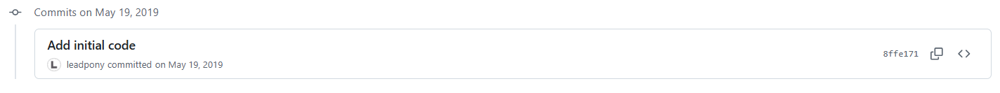
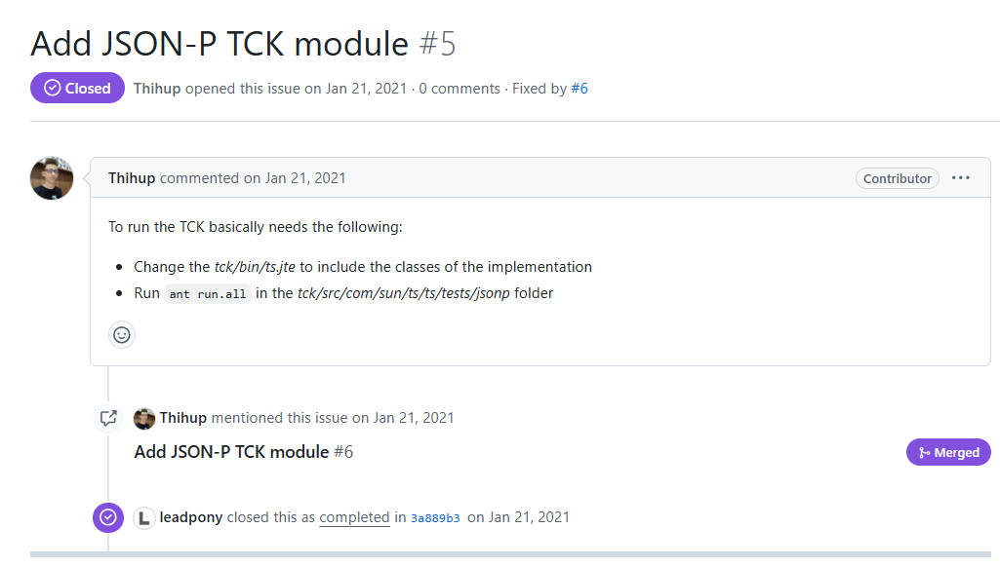
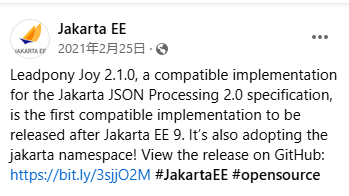
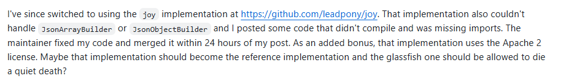

## 個人開発のすすめ

---

### 内容
* 2019年頃にJSONのパーサーを個人で開発したときの話
* 工夫したこと
* 学んだこと

---

### Java向けのJSONパーサー
* Jackson
* Gson
* JSON in Java (org.json)
*  ...
* **JSON-P**

---

### JSON Processing API (JSON-P)
* 2013年にJavaの公式APIとして提案された (JSR 374)
* OracleからEclipseのJakarta EEプロジェクトへ移管
    * パッケージが`javax.json`から`jakarta.json`に
* APIとその実装が完全に分離されている (SPI)
* 世に出ている実装
    * Eclipse Parsson (https://github.com/eclipse-ee4j/parsson) リファレンス実装
    * Apache Johnzon (https://johnzon.apache.org/)
    * Joy (https://github.com/leadpony/joy)
* JavaオブジェクトとJSONの変換にはJSON Binding API (JSON-B)を使う

---

### 開発の動機

* JSONパーサーを独力で書いてみたくなった
* Johnzonのコードをたまたま読んでいたら自分の方がずっと速いコードを書ける気がした

2019年のGW中に開発を始めた



ただし今はもうメンテしていない

---

### テスト駆動開発

* パーサーやバリデータの開発が好きなのは、テスト駆動開発しやすいから
* テストケースをJSON-Pの他の実装でも再利用できるように独立したプロジェクトにした
    * [JSON-P Test Suite](https://github.com/leadpony/jsonp-test-suite)
    * 全部で3,562テストケースを提供
* 当時は `git push` の度にTravis CIでビルド+ユニットテストしていた。今ならGitHub Actionsを使う

---

### 大量のテストケースを速く記述する技

* テストケースをJavaのコードではなくJSONやYAMLで表現する
* テストケースをenumの列挙子で表現する

    ```java
    enum ParserEventTestCase {
        EMPTY_ARRAY("[]", Event.START_ARRAY, Event.END_ARRAY),
        ARRAY_OF_ITEM("[42]", Event.START_ARRAY, Event.VALUE_NUMBER, Event.END_ARRAY),
        // 以下続く
    };
    ```

* JUnit 5の `@ParameterizedTest` をできるだけ使う

---

### ベンチマーキング (JMH)

* JMH (Java Microbenchmark Harness)を使って速度計測し、性能面のボトルネックの発見に役立てた
* これもJSON-Pの他の実装でも再利用できるように独立したプロジェクトにした
    * [jsonp-benchmark](https://github.com/leadpony/jsonp-benchmark)
* 初版は他の実装よりはるかに遅くて焦った記憶がある
    * 最終的にParssonと互角になった

---

### バージョニング

* [セマンティックバージョニング](https://semver.org/lang/ja/)を採用する
    * メジャー.マイナー.パッチ
* 仕掛中は`-SNAPSHOT`を付けるのがMavenの作法
* 変更履歴は[Keep a Changelog](https://keepachangelog.com/ja/1.0.0/)に準拠して [CHANGELOG.md](https://github.com/leadpony/joy/blob/master/CHANGELOG.md) に書く。
* リリース時にGitのタグを打って、GitHubの[Releasesページ](https://github.com/leadpony/joy/releases)にリリースする

---

### ライセンス

* ライセンスが不明なソフトウェアは怖くて使えない
* 第三者の著作物をリポジトリにコピーする場合はNOTICEファイルなどで出どころを明記する

---

### Maven Centralでの公開

* 開発したライブラリを[Maven Central](https://central.sonatype.com/)で公開するためには以下を決める必要がある
    1. Group ID
    2. Artifact ID
    3. バージョン
* JavaのトップレベルパッケージはGroup IDと一致することが望ましい (`org.leadpony.joy`)

--

* Group IDとしては以下のいずれかを選ぶ
    * GitHubのアカウント
        * com.github.アカウント名
        * io.github.アカウント名
    * 所有する独自ドメイン
* 独自ドメインの場合はDNSを使っての所有者の検証が入るため、登録に1-2日かかる
* リリースにはソースコードとJavadocのjarファイルを添えることが望ましい
* リリースすると40分程度で世界中から利用可能に

---

### javadoc.io

* Group ID+Artifact ID+バージョンの組み合わせからなるURLにアクセスすると、Maven CentralにアップロードしたJavadocのjarファイルからページを自動生成してくれる
* 初回だけ時間がかかるので、Maven Centralにリリースした直後に自分でアクセスしておく
* [Joy API Reference in Javadoc](https://javadoc.io/doc/org.leadpony.joy/joy-core/latest/org.leadpony.joy.core/module-summary.html)

---

### TCK

* Jakartaプロジェクトでは、APIに対して互換性のある実装と認められるためには、TCK (Technology Compatibility Kit)を通る必要がある
* ブラジルの人が突然コントリビュートしてくれた



--



---

### 結果: 惨敗

| Gitリポジトリ | スターの数 |
| --- | --- |
| Jackson | 9.1k |
| Parsson | 12
| Joy | 16 |

Jacksonが強すぎる

--



---

## 開発してよかったこと

* 単純に楽しめた
* テキスト処理の実装に関して少し自信がついた
* JSONの規格に強くなった
    * JSON [RFC 8259](https://datatracker.ietf.org/doc/html/rfc8259)
    * JSON Pointer [RFC 6901](https://datatracker.ietf.org/doc/html/rfc6901)
    * JSON Patch [RFC 6902](https://datatracker.ietf.org/doc/html/rfc6902)
    * JSON Merge Patch [RFC 7396](https://datatracker.ietf.org/doc/html/rfc7396)
* OSS開発者とのコミュニケーションに慣れた

---

### End of Presentation
#### Thank you!
